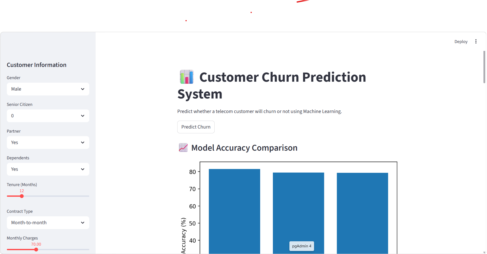
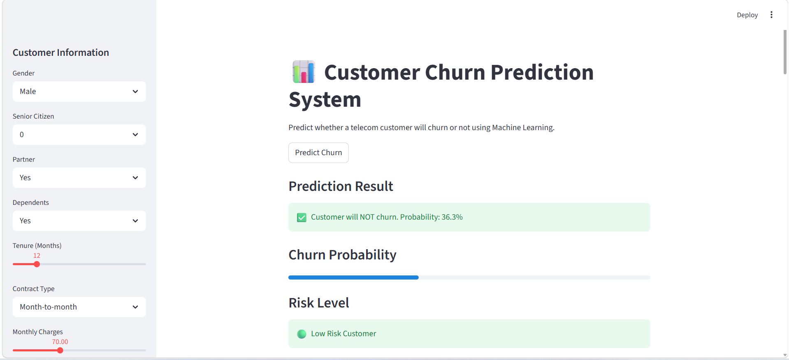
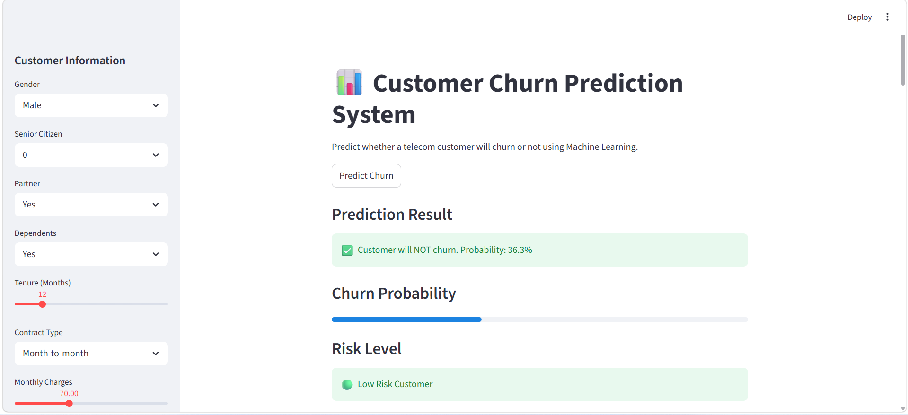

LIVE DEMO : https://kavya-makani-customer-churn-prediction-app-glmiwd.streamlit.app/

#  Customer Churn Prediction System

An end-to-end Machine Learning application that predicts whether a telecom customer is likely to churn, built with Python and deployed as an interactive Streamlit web app.

---

##  Problem Statement

Customer churn is a critical metric for telecom companies — losing a customer costs far more than retaining one. This project uses historical behavioral data to build a classification model that identifies at-risk customers before they leave, enabling targeted retention strategies.

---

##  Dataset

- **Source:** IBM Telco Customer Churn Dataset (via Kaggle)
- **Size:** ~7,000 customer records
- **Target Variable:** `Churn` (Yes / No)

**Key Features Used:**
| Feature | Description |
|---|---|
| `tenure` | Number of months the customer has stayed |
| `MonthlyCharges` | Monthly billing amount |
| `TotalCharges` | Total amount charged |
| `Contract` | Contract type (Month-to-month, One year, Two year) |
| `InternetService` | Type of internet service |
| `TechSupport` | Whether the customer has tech support |
| `PaymentMethod` | Mode of payment |
| `SeniorCitizen` | Whether the customer is a senior citizen |

---

##  Tech Stack

| Category | Tools |
|---|---|
| Language | Python 3 |
| Data Processing | Pandas, NumPy |
| Visualization | Matplotlib, Seaborn |
| Machine Learning | Scikit-learn, XGBoost |
| Web App | Streamlit |
| Model Persistence | Pickle |

---

##  Model Performance

Three classification models were trained and evaluated:

| Model | Accuracy |
|---|---|
| ✅ Logistic Regression | **81.6%** |
| Random Forest | 79.5% |
| XGBoost | 79.4% |

> **Why did Logistic Regression win?**
> Logistic Regression outperformed tree-based models here because the churn signal in this dataset is largely driven by linear relationships (e.g., high monthly charges + short tenure = high churn risk). With a moderately sized dataset and well-scaled features, a simple linear boundary generalizes better than more complex models prone to overfitting.

**Final model:** Logistic Regression — saved as `model.pkl`

---

##  Project Workflow

```
Raw Data → EDA → Preprocessing → Model Training → Evaluation → Streamlit App
```

1. **EDA** — Explored churn distribution, feature correlations, and customer segments
2. **Preprocessing** — Handled missing values, encoded categoricals, scaled numeric features
3. **Modeling** — Trained and compared 3 classifiers; selected best-performing model
4. **Deployment** — Built an interactive Streamlit app for real-time predictions

---

##  Screenshots

### Dashboard


### Real-time Prediction


### EDA Visualizations


---

##  Project Structure

```
customer-churn-prediction/
│
├── data/               # Raw and processed datasets
├── images/             # App screenshots
├── notebooks/          # EDA and model training notebooks
├── app.py              # Streamlit web application
├── model.pkl           # Saved Logistic Regression model
├── requirements.txt    # Python dependencies
└── README.md
```

---

## 🚀 Run Locally

```bash
# 1. Clone the repository
git clone https://github.com/Kavya-Makani/customer-churn-prediction.git
cd customer-churn-prediction

# 2. Install dependencies
pip install -r requirements.txt

# 3. Launch the app
streamlit run app.py
```

---

##  Key Takeaways

- Month-to-month contract customers churn at a significantly higher rate than those on annual contracts
- High monthly charges combined with low tenure are the strongest churn indicators
- Logistic Regression is a strong, interpretable baseline for structured tabular classification tasks

---

[GitHub](https://github.com/Kavya-Makani)
